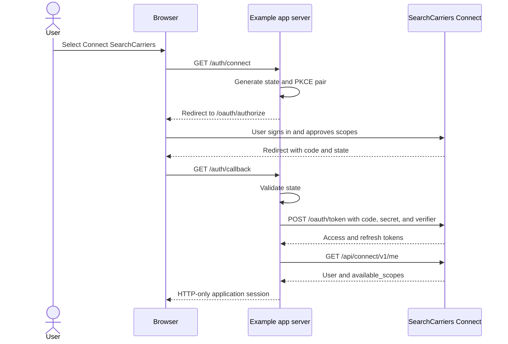

# SearchCarriers Connect example app

A working reference implementation for building a server-rendered web application with [SearchCarriers Connect](https://searchcarriers.com/developer/integrations/connect).

This repository is a small carrier research product called **Carrier Signal Desk**. It demonstrates the complete OAuth 2.0 Authorization Code flow with PKCE, then uses the connected account for company search, company details, risk signals, vetting reports, company watches, and an illustrative score derived from the returned data.

> This is sample code, not a hosted SearchCarriers product. Review the [production checklist](docs/PRODUCTION_CHECKLIST.md) before adapting it for a real application.

## What it demonstrates

- OAuth 2.0 Authorization Code with PKCE and `state` validation
- Confidential-client token exchange without exposing the client secret to the browser
- Access and refresh tokens stored in an HTTP-only server session
- Automatic refresh before expiry and one retry after an API `401`
- `GET /api/connect/v1/me` as the source for the connection's currently usable scopes
- UI and API requests that adapt when `risk:read`, `vetting:read`, or `watches:read` is unavailable
- An example Carrier Readiness Score that turns returned company, risk, BASIC, and vetting data into transparent product logic
- A small server-side proxy so bearer tokens never reach browser JavaScript
- Tests for the OAuth flow and entitlement-sensitive field selection

## Prerequisites

- Node.js 20 or newer
- A SearchCarriers account
- A SearchCarriers Connect app and its client ID and client secret

## 1. Register the app

In SearchCarriers, open **Settings > Apps**, select **Develop an app**, and create an app with this redirect URI:

```text
http://localhost:3000/auth/callback
```

Request these scopes for the full example:

| Scope | Example use |
| --- | --- |
| `search` | Search carrier records |
| `company:read` | Read a selected company profile |
| `risk:read` | Request risk factors and BASIC scores |
| `vetting:read` | Request a vetting report |
| `watches:read` | List the connected user's company watches |

An app in testing can be connected by its owner and configured test users. Public users can connect after the app passes review.

## 2. Configure the example

```bash
npm install
cp .env.example .env
openssl rand -base64 48
```

Put the generated value in `SESSION_SECRET`, then add the app credentials to `.env`:

```dotenv
PORT=3000
APP_BASE_URL=http://localhost:3000
SESSION_SECRET=replace-with-the-generated-value

# Use https://searchcarriers.com for production SearchCarriers.
SC_BASE_URL=https://searchcarriers.com
SC_CLIENT_ID=your-client-id
SC_CLIENT_SECRET=your-client-secret
SC_SCOPES=search company:read risk:read vetting:read watches:read
```

For a local SearchCarriers checkout, use its local URL instead:

```dotenv
SC_BASE_URL=http://oauth2-third-party-integr.test
```

The redirect URI in SearchCarriers must exactly match `${APP_BASE_URL}/auth/callback`.

## 3. Run it

```bash
npm run dev
```

Open [http://localhost:3000](http://localhost:3000), select **Connect SearchCarriers**, and approve the grant. Carrier Signal Desk can then search for a company, load its profile, conditionally request risk or vetting data, and calculate an illustrative Carrier Readiness Score from the data that was actually available.

The score is intentionally simple and fully explained in [`src/carrier-score.ts`](src/carrier-score.ts). It is not an official SearchCarriers score; it shows how an integration can transform authorized API data into its own domain-specific workflow.

## How the flow works



The important implementation files are:

| File | Responsibility |
| --- | --- |
| [`src/oauth.ts`](src/oauth.ts) | PKCE and constant-time `state` comparison |
| [`src/connect-client.ts`](src/connect-client.ts) | Token exchange, refresh rotation, bearer requests, and API errors |
| [`src/server.ts`](src/server.ts) | OAuth routes, server session, and browser-safe API proxy |
| [`src/connect-fields.ts`](src/connect-fields.ts) | Maps live scope availability to optional company field sections |
| [`src/carrier-score.ts`](src/carrier-score.ts) | Builds the transparent illustrative score from returned Connect data |
| [`public/app.js`](public/app.js) | Example workflow and scope-aware UI |

## Requested scopes vs. available scopes

`SC_SCOPES` is the maximum set the app asks the user to grant. A granted scope may later become unusable if the connected user changes plans or loses the backing SearchCarriers feature.

Call `GET /api/connect/v1/me` after connecting and whenever access may have changed:

```json
{
  "user": {
    "id": "42",
    "name": "Taylor Example",
    "email": "taylor@example.com"
  },
  "available_scopes": [
    "search",
    "company:read",
    "risk:read"
  ]
}
```

`available_scopes` is the intersection of the token's granted scopes and the connected user's current SearchCarriers access. Use it to decide which endpoints and field sections to offer. SearchCarriers still enforces this live on every request; client-side gating is only for a clear user experience.

In the example above, the app may request risk data but must not request `fields=vetting_report` because `vetting:read` is absent.

## Connect endpoints used

The browser calls local routes; the Node server attaches the bearer token and calls SearchCarriers:

| Local example route | SearchCarriers request | Required available scope |
| --- | --- | --- |
| `GET /api/session` | `GET /api/connect/v1/me` | Authenticated connection |
| `GET /api/search?q=acme` | `GET /api/connect/v1/search?superSearchTerm=acme` | `search` |
| `GET /api/company/1911857` | `GET /api/connect/v1/company/1911857?fields=...` | `company:read` plus field-specific scopes |
| `GET /api/watches` | `GET /api/connect/v1/watches` | `watches:read` |

Search returns the same paginated v3-style resource used by the Connect reference:

```json
{
  "data": [
    {
      "dot_number": "1911857",
      "legal_name": "Example Carrier LLC",
      "dba_name": null,
      "docket_numbers": ["MC123456"],
      "dot_status": "Active",
      "operation_type": "Interstate",
      "power_units": 24,
      "physical_address": {
        "city": "Atlanta",
        "state": "GA"
      },
      "contact": {
        "email_address": "dispatch@example.com",
        "phone": "5551234567"
      }
    }
  ],
  "links": {},
  "meta": {
    "current_page": 1,
    "per_page": 10,
    "total": 1
  }
}
```

The company profile always includes its base identity and address data. The example requests core sections and adds optional sections only when the corresponding scope is available:

```text
fields=contact,logo,operation,service_areas,risk_factors,basic_scores
```

- `risk_factors` and `basic_scores` require `risk:read`.
- `vetting_report` requires `vetting:read`.
- Other plan-enabled v3 field sections remain governed by `company:read` and the connected user's live entitlements.

See the [generated endpoint reference](https://searchcarriers.com/developer/integrations/connect) for every query parameter and response schema, or download the [Connect OpenAPI document](https://searchcarriers.com/developer/integrations/connect/openapi.json).

## Error handling

- `401`: the example refreshes once. If refreshing fails, ask the user to reconnect.
- `403`: the token scope or the user's current plan no longer permits the request. Re-fetch `/api/connect/v1/me` and update the UI.
- `422`: fix invalid search parameters, DOT numbers, or field masks.
- `429`: respect the response and retry after the rate-limit window; do not spin in a retry loop.

## Security choices

- The client secret, access token, and refresh token never enter browser JavaScript.
- Each authorization starts with new high-entropy `state` and PKCE values.
- OAuth callback state expires after ten minutes and is consumed once.
- The session ID is regenerated after a successful code exchange.
- Cookies are HTTP-only, `SameSite=Lax`, and secure in production.
- Helmet supplies a restrictive Content Security Policy.

The built-in `express-session` memory store is intentionally suitable only for local development. Use a durable encrypted session store in production.

## Verification

```bash
npm test
npm run typecheck
npm run build
```

The test suite covers PKCE, state rejection, confidential-client code exchange, and scope-aware company field selection.

## License

MIT
